# Planner

A desktop project planner for Windows. Create tasks and subtasks with no depth limit, estimate them Jira-style and export a PDF quote ready to present to your client.

A subtask can belong to several tasks at once, and hours, cost and duration still count it **only once**. The interface and the PDF are available in **English and Spanish**.

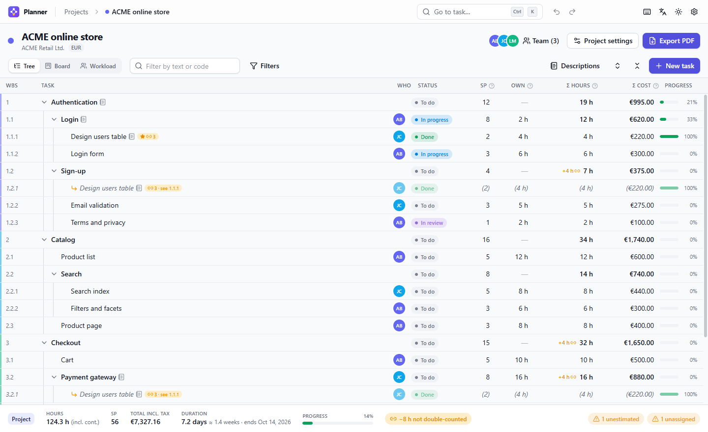

## Contents

1. [Features](#features)
2. [Screenshots](#screenshots)
3. [Installation](#installation)
4. [User guide](#user-guide)
5. [Development](#development)
6. [Building the .exe](#building-the-exe)
7. [Architecture](#architecture)
8. [Internationalization](#internationalization)
9. [Domain model and calculations](#domain-model-and-calculations)
10. [Persistence](#persistence)
11. [IPC and security](#ipc-and-security)
12. [PDF generation](#pdf-generation)
13. [Tests](#tests)
14. [Adding a feature](#adding-a-feature)
15. [Troubleshooting](#troubleshooting)
16. [License](#license)

---

## Features

| | |
|---|---|
| **Projects as cards** | Each project has a name, client, color, its own currency (EUR, USD…), a default rate, contingency, tax and working days. From the card you can duplicate it, archive it, export a backup, import one back and move it to the trash. |
| **Tasks with no depth limit** | A virtualized tree with WBS codes (1, 1.1, 1.1.1…) that stays smooth with thousands of tasks. It is edited with the keyboard, like an outliner. Long titles wrap onto several lines. |
| **Task data** | Status, priority, assignee, story points, estimated hours, own rate, tags and description. Hours accept several formats: `1.5`, `90m`, `1h 30m` or `2d`. |
| **Tags** | Each project has its own colored tags. Create one once and pick it for any task; it shows next to the title in the tree, on the board cards and, optionally, in the PDF. Rename or recolor it and every task changes. Filter by tag and tag several tasks at once. |
| **Hours from story points** | Each project can have a scale (“1 point = 2 h”, rule of three, with exceptions such as “5 points = 8 h”). Tasks with story points and no hours typed by hand take their hours from it, and changing the scale updates them all. |
| **Shared subtasks** | A subtask can hang from several tasks and still counts once. The app shows how much double counting was avoided. |
| **Team and workload** | Each person has a role, a rate and working hours per day. The workload view splits the work per person and works out the project duration and end date. |
| **Kanban board** | One column per status. Drag a card to change the status of its task. |
| **Sprints and status history** | Every status change of a task is recorded with its date and time. Each project sets the length of its sprints (days, weeks or months), and the PDF shows, sprint by sprint, which tasks moved forward or back. |
| **PDF quote** | It includes these sections:<ul><li>Cover</li><li>Financial summary</li><li>WBS breakdown with subtotals</li><li>Task details (descriptions)</li><li>Task status: lanes by status and progress by sprint (optional)</li><li>Team and workload</li><li>Shared subtasks appendix</li><li>Particular and general terms</li><li>Acceptance and signatures</li></ul>The table adds up exactly to the total. |
| **The quote as a contract** | The PDF can be signed to close the project: the parties with their details, what they accept, the governing law and courts, room for both signatures and boxes for the initials on every page. A library keeps your contracts per country (general terms, law and courts) and texts to reuse in the particular terms of any project. |
| **Resizable layout** | Widen or narrow every column of the tree and the detail panel by dragging their edges. The widths are remembered. |
| **English and Spanish** | Switch the interface language at any time; choose the PDF language when exporting. Numbers and dates follow the language (`€7,327.16` / `7.327,16 €`). |
| **Light / dark mode** | Light, dark or follow the system. The PDF is always light, ready to print. |
| **Undo / redo** | Up to 100 steps per project. |
| **Local and safe data** | No server and no account. Each project is a JSON file written atomically, plus a `.bak` copy, daily backups, automatic recovery and backups you export yourself. |

## Screenshots

<table>
<tr>
<td width="50%">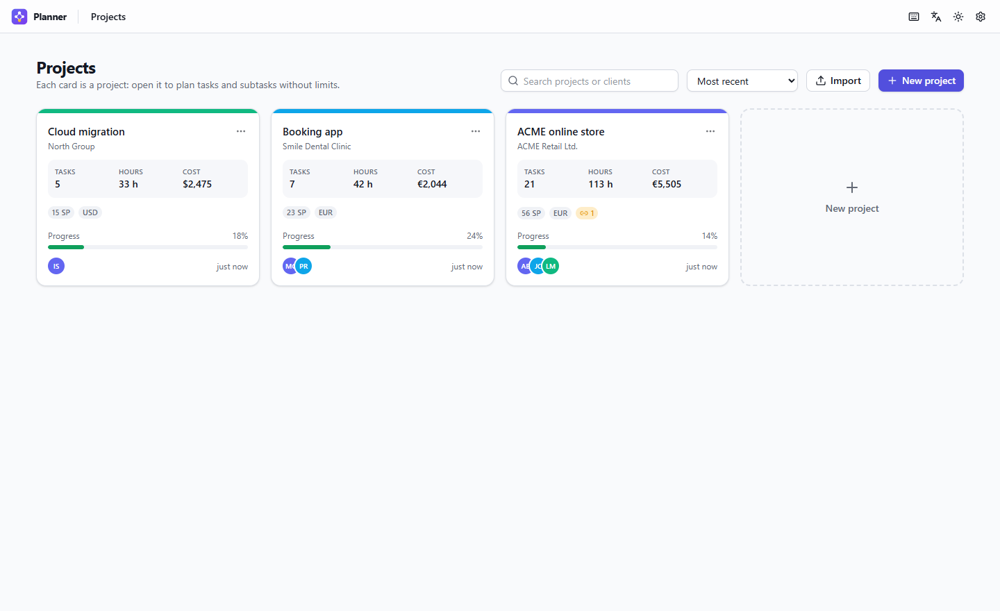<br><sub>Projects as cards, each with its own currency and totals.</sub></td>
<td width="50%">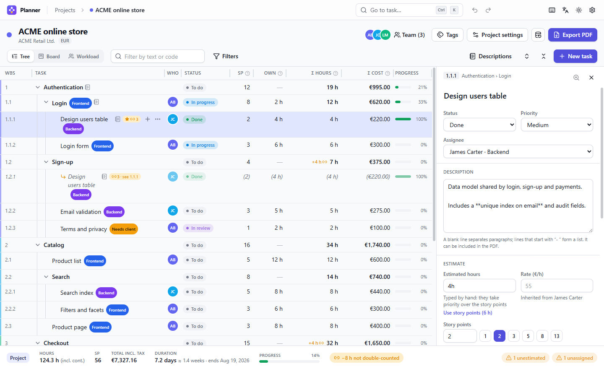<br><sub>Detail panel of a subtask shared by three tasks.</sub></td>
</tr>
<tr>
<td>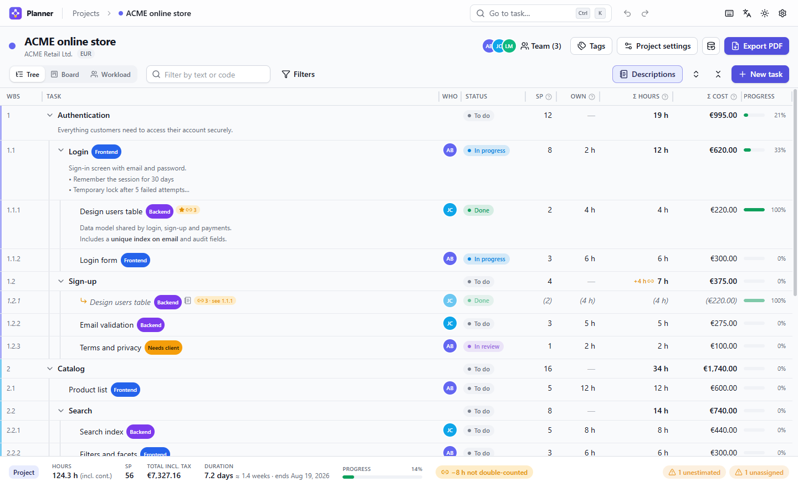<br><sub>Descriptions shown under each task (“Descriptions” button or Alt+D).</sub></td>
<td>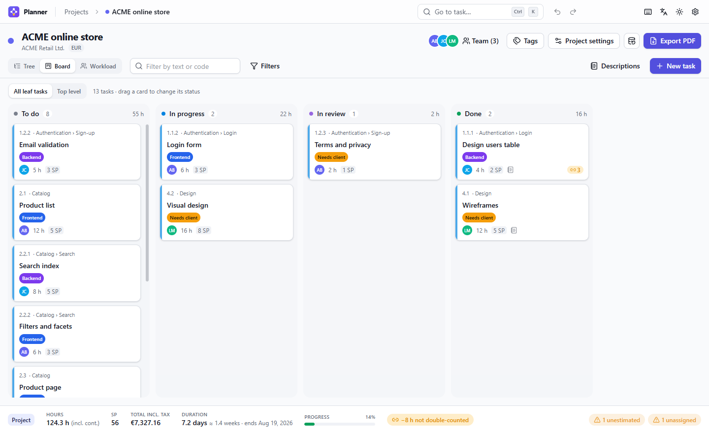<br><sub>Kanban board by status.</sub></td>
</tr>
<tr>
<td>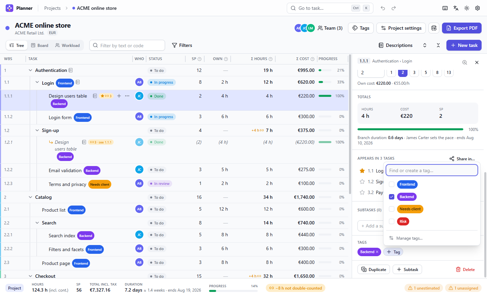<br><sub>Project tags, picked for a task from its detail panel.</sub></td>
<td>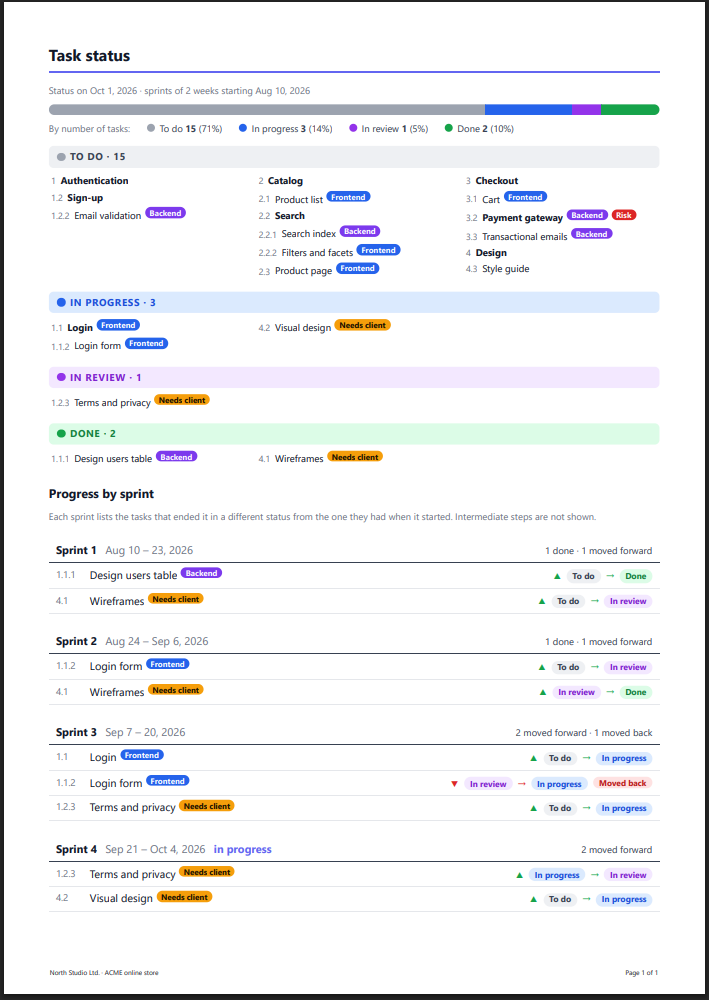<br><sub>“Task status” in the PDF: lanes by status and progress by sprint.</sub></td>
</tr>
<tr>
<td>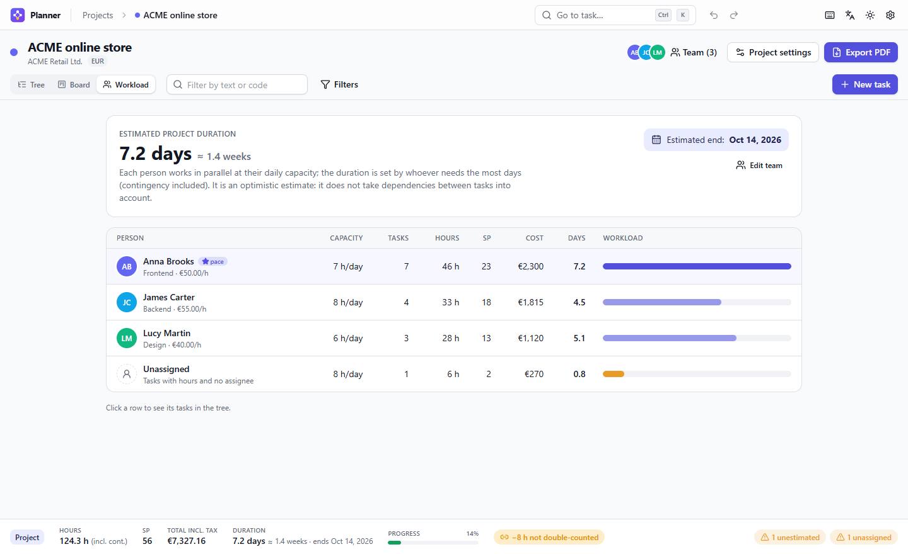<br><sub>Workload per person, estimated duration and end date.</sub></td>
<td>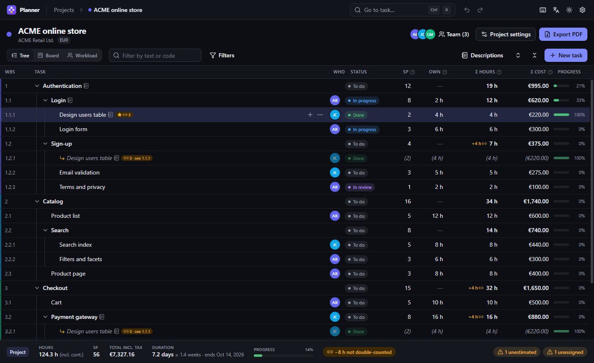<br><sub>Dark mode.</sub></td>
</tr>
</table>

The screenshots and the [sample PDF](docs/sample-quote.pdf) are regenerated with `pnpm docs:screenshots` (see [scripts](#scripts)).

---

## Installation

**Requirements:** Windows 10 or 11, 64-bit. Nothing else needs to be installed.

There are two executables. They are built into `release/` with `pnpm dist:win` (see [Building the .exe](#building-the-exe)).

| File | What it is | Where it stores the data |
|---|---|---|
| `Planner-1.0.0-setup.exe` | Installer. Lets you choose the folder, creates desktop and Start menu shortcuts, and is uninstalled from “Apps”. | `%APPDATA%\Planner\data` |
| `Planner-1.0.0-portable.exe` | A single `.exe` that needs no installation; you can carry it on a USB drive, for example. | `PlannerData` folder next to the `.exe`. If that folder is not writable, `%APPDATA%\Planner\data`. |

**SmartScreen warning.** The executables are not signed, so the first time Windows may show “Windows protected your PC”. Click “More info” and then “Run anyway”.

**Where is my data?** Go to Settings (⚙) → General → Data → “Open folder”. The contents of that folder are explained in [Persistence](#persistence).

---

## User guide

### Projects

- **Create a project.** Click “New project” and enter the name, client and currency. Everything else is set later in “Project settings”:
  - default rate and working hours per day;
  - story points → hours scale;
  - length of the sprints;
  - contingency (%) and tax (%);
  - start date and working days;
  - quote number, date, validity and terms.
- **What each card shows:**
  - tasks, hours, cost, story points and currency;
  - number of shared subtasks (🔗);
  - progress and team.
- **The card's “⋯” menu.** Open, Duplicate, Export PDF…, Export backup…, Archive / Restore and Delete… (which moves the project to the trash).
- **Backups.** See [Backups](#backups).
- **Search and sort.** Search by project or client. Sort by most recent, by name or by cost.

### Tasks and subtasks

- **Create tasks.** Use “New task” or press **Enter** on a task. When you finish a title, Enter creates the next one, **Tab** turns it into a subtask of the previous one and **Shift+Tab** moves it up a level. You can write a whole plan without touching the mouse.
- **Edit.** Select a task and press **Space** to open the detail panel. It holds the status, priority, assignee, description, hours, rate, story points and tags.
- **Row menu** (right click or “⋯”):
  - add a subtask or a task below;
  - link an existing subtask, or also share the task in another one;
  - move it elsewhere, indent or outdent, move up or down;
  - duplicate;
  - focus on this task (shows only its branch);
  - copy to share, paste as shared subtask, and remove from here.
- **Several tasks at once.** Select them with **Shift+↑/↓**, Shift+click or Ctrl+click. A bar appears to change the status, priority, assignee or tags of all of them.
- **Filter.** Search by text (titles and tag names) or WBS code. “Filters” narrows the tree by:
  - status;
  - assignee;
  - tags;
  - warnings: unestimated, unassigned, no rate, shared.
- **Expand and navigate.** “Expand levels” opens the tree down to the level you choose. **Ctrl+K** jumps to any task.
- **Delete a task with subtasks.** Two options are offered: delete it with its subtasks, or delete only that task and move its subtasks up a level. Subtasks that also hang from another task are never lost.

**Tree columns:**

| Column | Meaning |
|---|---|
| **Own** | Hours of the task itself, without its subtasks: typed by hand, or in grey when they come from its story points. |
| **Σ Hours / Σ Cost** | What the branch contributes to the total. That is why the rows can be added up (see [calculations](#domain-model-and-calculations)). |
| **+X h 🔗** | Hours of shared subtasks this branch also needs but that are counted in another branch. |

Long titles wrap onto several lines (their tags flow after them), so nothing is cut. To change the width of a column, drag the edge of its header; double-click the edge to go back to the default width. See [Layout](#layout).

**Bottom bar:**

- hours (with contingency), story points, total including tax, duration, end date and progress;
- “−X h not double-counted”, with what was saved by not counting shared subtasks twice;
- warnings for unestimated or unassigned tasks.

### Shared subtasks

A shared subtask is the same task hanging from several tasks. For example, “Design users table” is needed by “Login”, “Sign-up” and “Payment gateway”.

1. Select the subtask and press **Ctrl+Shift+C** (or “Copy to share”).
2. Select the other task that also needs it and press **Ctrl+Shift+V** (or “Paste as shared subtask”).

In the tree, each appearance is shown like this:

| Appearance | How it looks | Counts in the totals |
|---|---|---|
| **Primary** | Marked with **★**. | Yes, with its hours and cost. |
| **The others** | References in italics: `↳ Design users table · 🔗3 · see 1.1.1`, with the figures in brackets. | No. |

To count it in another branch, use “Make primary: count here” in the detail panel.

Deleting a reference (“Remove from here” or **Del**) only removes it from that task; the subtask is not deleted.

### Team and rates

- **Team.** In “Team” you add people with a name, role, rate, hours per day and color. You can also import the team of another project.
- **Rate of each task.** The first one that exists is used, in this order:
  1. the task's own rate;
  2. the assignee's rate;
  3. the project's default rate.
- **Removing a person.** Their tasks are reassigned to someone else or left unassigned.

### Estimating

- **Hours.** The field accepts several formats:
  - `1.5` or `1,5` (hours);
  - `90m` or `90 minutes`;
  - `1h 30m`, `1h30` or `1:30`;
  - `2d` or `2 days` (days of the project's hours per day).
- **Story points.** There are quick buttons (1, 2, 3, 5, 8, 13), and any value can be typed.
- **Duration.** It comes from each person's workload (see [calculations](#duration-and-end-date)).

#### Hours from story points

Instead of typing the hours of every task, you can let the story points set them. In Project settings → Story points:

- **The base.** Write how much **1 point** is worth (`2h`, `90m`, `1.5`…). Every other value follows the rule of three: 5 points = 5 × 2 h = 10 h.
- **Exceptions.** Each row of the scale (2, 3, 5, 8, 13) shows what the rule of three gives; type a value to change it, for example 5 points = 8 h. Values outside the scale (4, 0.5, 21…) always follow the rule of three.
- **Automatic hours.** A task with story points and no hours typed by hand takes its hours from the scale. They show in grey in the tree, and the detail panel says where they come from. Changing the scale updates all of them at once, and it can be undone.
- **Typed hours win.** Typing hours in a task overrides the scale for that task. Empty the field, or use “Use story points” in the detail panel, to go back to the story points.
- **Off by default.** New projects start without a scale. Leaving 1 point empty turns it off: hours then only come from what you type.
- Parent tasks: their own story points give them own hours too, in addition to those of their subtasks, just like typed hours.

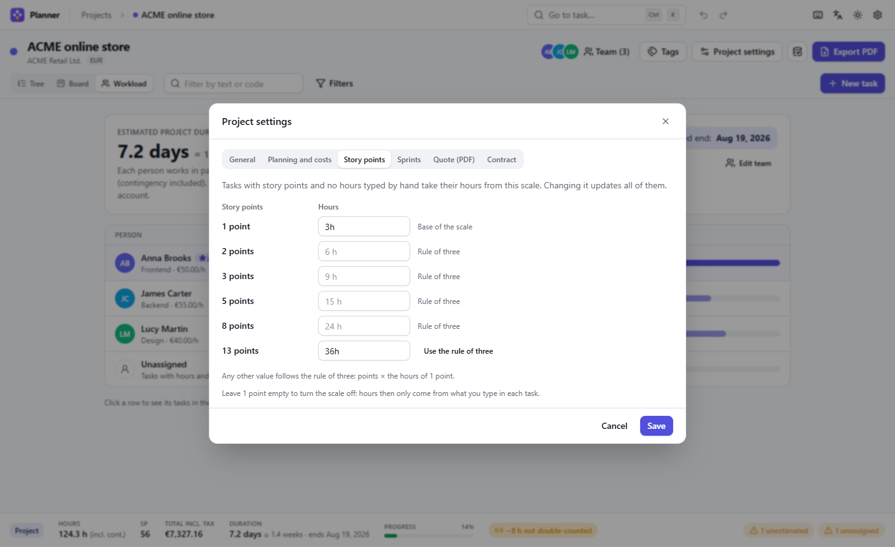

### Views

| View | What it is for |
|---|---|
| **Tree** | Planning the whole structure (WBS), with totals per branch. |
| **Board** | Following the status of the leaf tasks or of the top-level tasks. Drag a card to change its status. |
| **Workload** | Hours, cost and days per person. Whoever needs the most days sets the pace (★). Clicking a row shows their tasks in the tree. |

### Descriptions

- **Where they are written.** In the detail panel, with light formatting:
  - an empty line separates paragraphs;
  - lines starting with `- `, `* ` or `• ` form a list;
  - lines starting with `1. ` form a numbered list;
  - `**text**` is shown in bold.
- **Showing them in the tree and the board.** The “Descriptions” button (or **Alt+D**) shows or hides them under each task.
- **In the PDF.** Chosen when exporting:
  - do not include them;
  - under each task of the breakdown;
  - in a separate “Task details” section (the default).

### Tags

Tags belong to the project: each one is **created once**, with a name and a vivid color, and then **picked** for any task, so you never type it again.

- **Tag a task.** In the detail panel, “+ Tag” opens a list of the project's tags: tick or untick them. Type to search; if the name does not exist yet, “Create ‘…’” creates it and gives it to the task in one step. Remove a tag with the × of its chip.
- **Several tasks at once.** With several tasks selected, “Tags” in the bottom bar gives a tag to all of them, or takes it away if all of them already have it.
- **Manage them.** The “Tags” button next to “Team” lists every tag with the number of tasks that use it. Rename it, change its color or delete it there; every task changes at once. A new tag takes the next color of the palette.
- **Where they show.** Next to the title in the tree, on the board cards and in the detail panel. “Filters” → Tags shows only the tasks with any of the chosen tags, and the text filter also finds tags by name.
- **In the PDF.** Tick “Tags” when exporting to print them next to each task.
- **Limits.** Up to 200 tags per project and 20 per task; names of up to 40 characters, unique in the project (case does not matter).

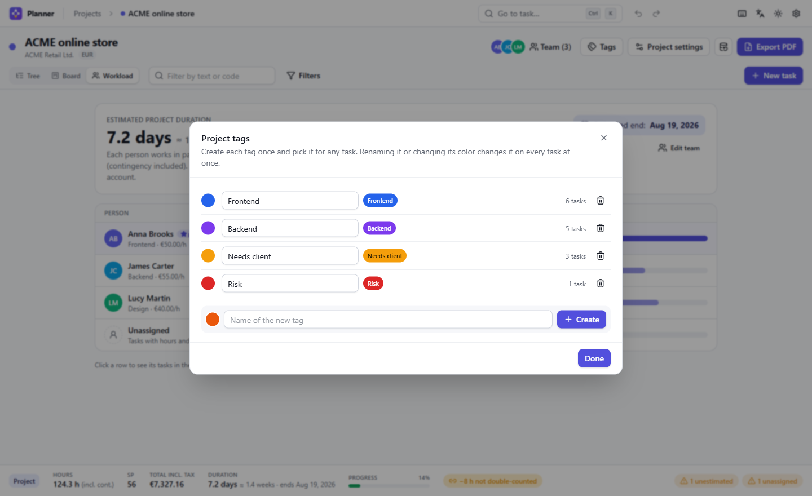

### Sprints and progress

- **Status history.** Every time a task changes status (in the tree, the board, the detail panel or the bottom bar), the app records the change with its date and time. Undoing the change also removes it from the history. Nothing else has to be done.
- **Sprints.** Project settings → Sprints sets their length: a number of days, weeks or months (shortcuts: 1 week, 2 weeks, 1 month). New projects use 2 weeks. Sprint 1 starts on the project start date or, if it has none, on the day the project was created; the tab shows the current sprint. Untick “This project works in sprints” to turn them off.
- **In the PDF.** Ticking “Status” in the export dialog adds the status column **and** a “Task status” section:
  - a bar and a legend with how many tasks are in each status;
  - **lanes by status** (To do, In progress, In review, Done) with every task, parent tasks in bold, three columns per lane so it stays compact with hundreds of tasks;
  - **progress by sprint**: for each sprint, the tasks whose status at the end differs from their status at the start, as “To do → Done”. Steps in between are ignored, and a task that ends the sprint as it started it is not listed. Green ▲ means it moved forward; red ▼ and “Moved back” mean it went back. Sprints in a row without changes share one line.
- **Changing the length** of the sprints regroups the changes already recorded.

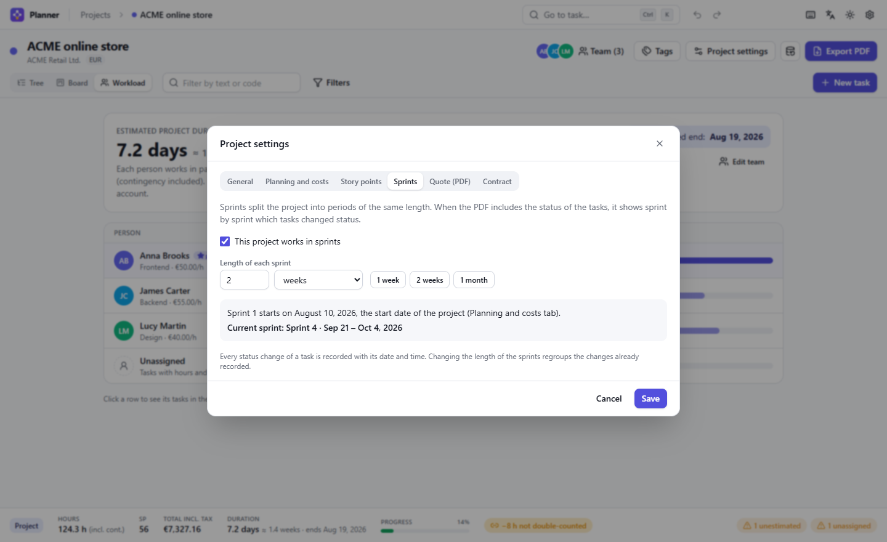

### Backups

The data folder already keeps a `.bak` copy and daily backups automatically (see [Persistence](#persistence)). A backup you export yourself is a single file you can keep anywhere.

- **Export.** “Export backup…” in the menu of the project card, or the backup button (🗄) next to “Export PDF” inside the project. It saves `<project>.planner.json` where you choose: the same format the app stores, with its tasks, team, tags, sprints and status history.
- **Import.** “Import backup…” on the projects screen. If that project no longer exists, it comes back as it was. If it still exists, you choose:
  - **Keep both:** the backup is added as a copy with a new name (“… (imported)”);
  - **Replace:** the backup takes the place of the current version, which is moved to the trash folder, so it can still be recovered.
- A project created with a newer version of Planner (open in read-only mode) cannot be exported or duplicated, because this version would leave out what it does not know.

### The quote as a contract

The PDF can close the project: when both parties sign it, the quote works as the contract between them. It is set up in three places.

1. **Settings → Your details.** Your details as the provider, the name of your tax ID as the PDF shows it (RUT, C.I., NIF…) and who signs your quotes: name, ID document and position (only if you sign for a company).
2. **Settings → Contracts.** The library of contracts, written once and reused in every project:
   - **Contract models**, usually one per country. Each has a name, the governing law and the courts for disputes, and the general terms (separate the clauses with a blank line). The first model is the default one; “Make default” chooses another. If you move to another country, add a model for it.
   - **Saved texts:** clauses to reuse in the particular terms of any project.
3. **Project settings → Contract.**
   - **Contract model:** the default one, or the model of the client's country. A project points to its model, so editing a model changes the next PDFs of every project that uses it. If its model is deleted, the project goes back to the default one.
   - **The client in the contract:** company or full name, tax ID, address, email, and who signs for the client (name, ID document and position).
   - **Particular terms:** those of this project. Where they say nothing, the general terms apply; if they contradict each other, these prevail.
     - **Insert saved text** adds a text of the library at the end, with the next clause number when the terms are numbered.
     - **Save to the library** keeps these terms for later projects, as one text or clause by clause, each clause named after its title. Texts already in the library are not saved twice.

The number, date and validity of the quote stay in the “Quote (PDF)” tab.

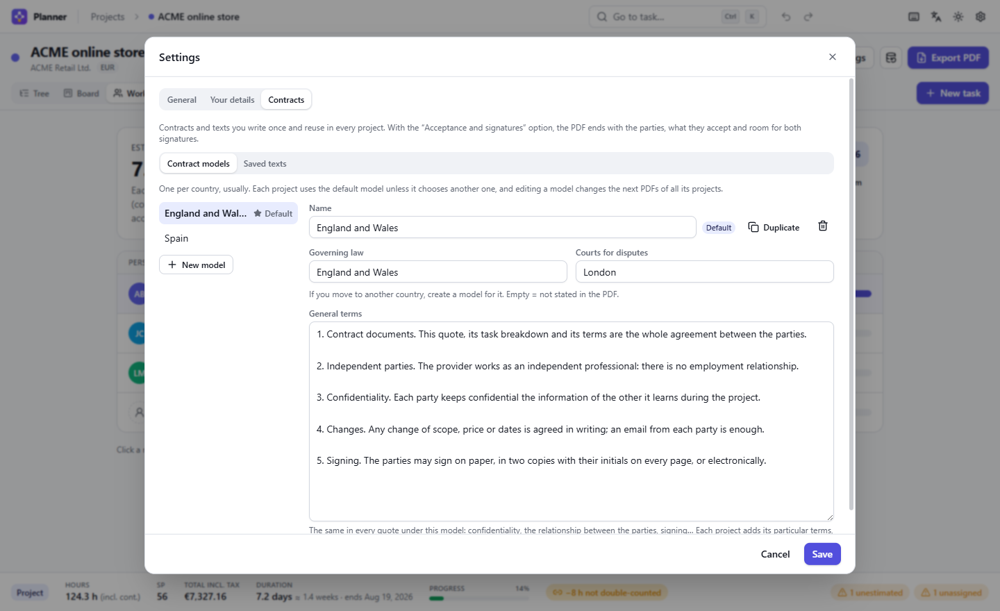

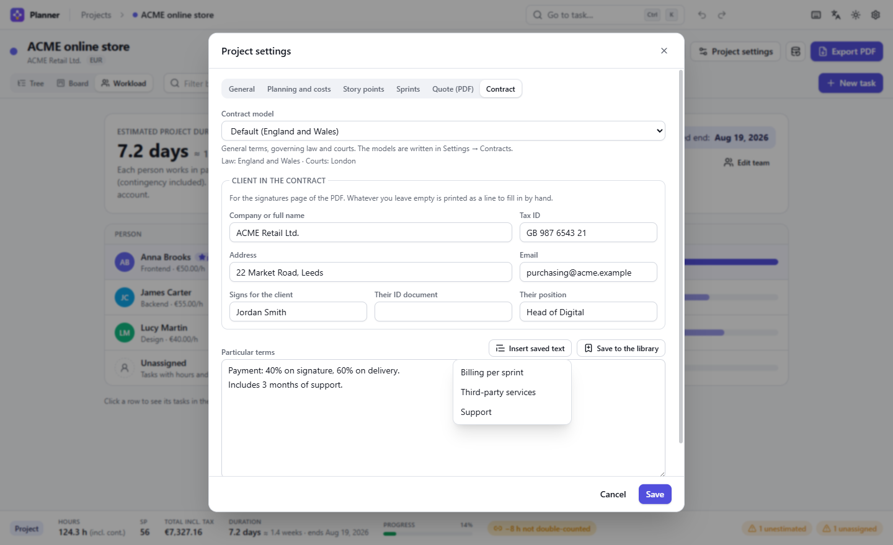

The “Acceptance and signatures” section of the export closes the PDF. It shows:
- the parties with their details;
- what they accept: the quote with its number and date, the scope in the breakdown, the amount and the terms, and how long the offer is valid;
- the governing law and the courts;
- a block for each signature, with the signer's name, ID document, position, and place and date.

Any detail left empty is printed as a line to fill in by hand, so the same PDF can be completed when signing.

Ways to sign:
- **On paper:** two copies, signed at the end, with the initials of both parties in the boxes of the footer of every page, so no page can be swapped. Every page also names the quote and its number.
- **Electronically:** if you sign this way, the initials boxes can be turned off in the export dialog.

A quote with a number is easier to refer to; the export dialog warns when it has none.

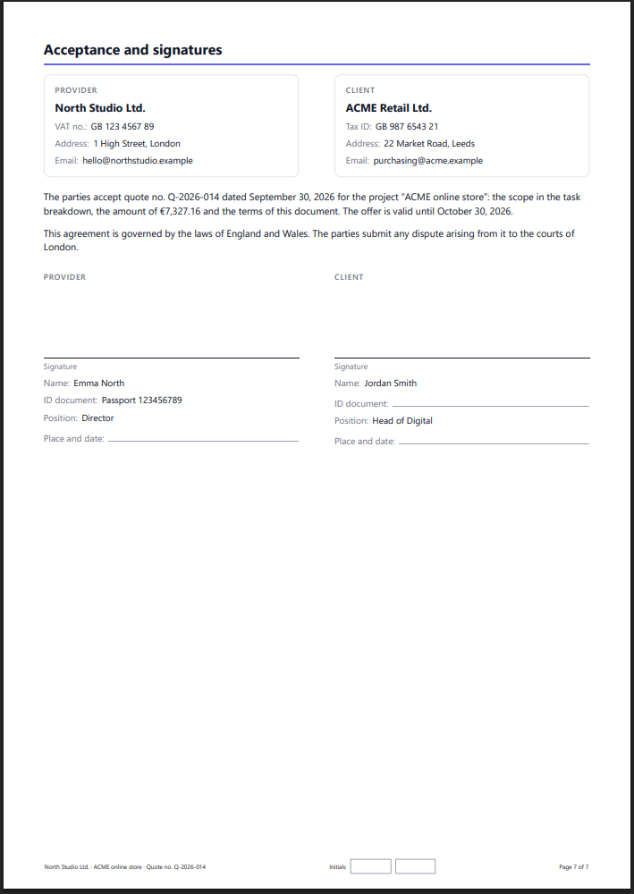

> Planner gives the contract its structure, not legal advice. Have a lawyer of your country review your general terms once, since every quote reuses them.

### Layout

- **Columns of the tree.** Drag the edge of a column header to widen or narrow it; double-click the edge to go back to its default width. The task column takes the free space: dragging it sets its minimum width.
- **Detail panel.** Drag its left edge to make it wider or narrower (between 320 px and 60% of the window); double-click to go back to 400 px.
- The widths are remembered on this computer for every project.

### Exporting to PDF

Use “Export PDF” inside the project or in the menu of its card. You can choose:

- the **PDF language** (English or Spanish), independently of the interface language;
- the sections and the columns (hours, amounts, rate, story points, assignee, status and tags). **Status** also adds the “Task status” section with the progress by sprint (see [Sprints and progress](#sprints-and-progress));
- the depth of the breakdown and down to which level subtotals are added;
- the paper (A4 or Letter) and the orientation;
- where the descriptions go.

The options, including the language, are remembered per project. The issuer details (name, tax ID, address, email, phone, website and logo) are set once in Settings → Your details and appear on the cover and in the footer. To close the project with the PDF, see [The quote as a contract](#the-quote-as-a-contract).

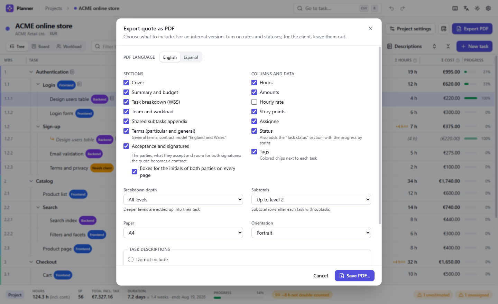

These are four pages of the [sample PDF](docs/sample-quote.pdf), exported with statuses and tags:

<table>
<tr>
<td width="25%">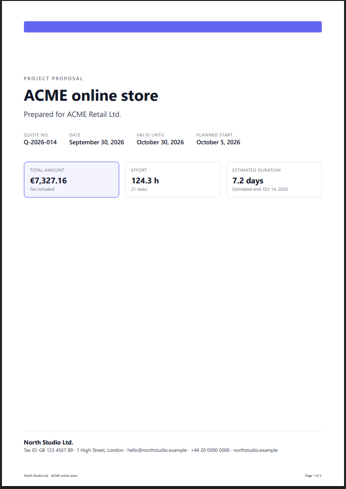<br><sub>Cover</sub></td>
<td width="25%">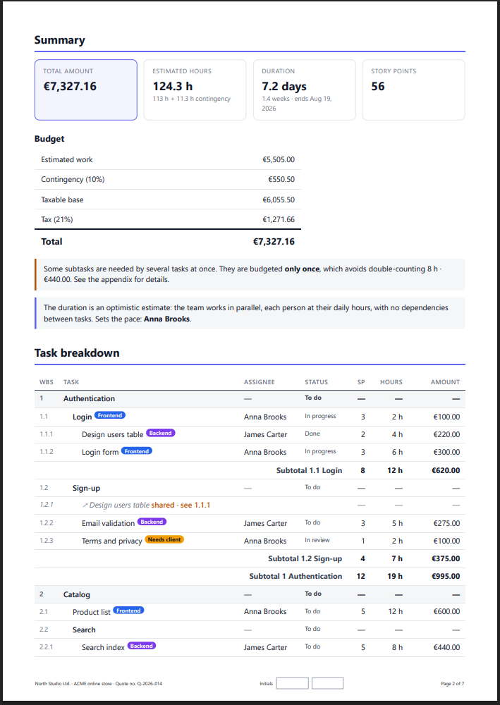<br><sub>Summary and breakdown</sub></td>
<td width="25%">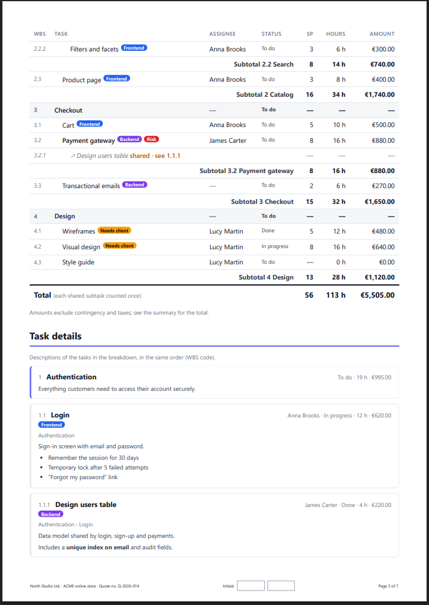<br><sub>Total and “Task details”</sub></td>
<td width="25%"><br><sub>Task status and progress by sprint</sub></td>
</tr>
</table>

### Language

- **Interface.** Use the language button in the top bar (the 文A icon), or Settings → General → Language. The options are English, Español and System. The interface switches immediately.
- **System.** Follows the Windows display language: Spanish if it is Spanish (or Catalan, Galician or Basque), English otherwise.
- **Formats.** English uses US formats (`€7,327.16 · 124.3 h · Sep 30, 2026 · 21%`); Spanish uses Spanish formats (`7.327,16 € · 124,3 h · 30 sept 2026 · 21 %`). Numbers can be typed with either decimal separator.
- **PDF.** Its language is chosen in the export dialog and remembered per project.
- **Your data is never translated.** Task titles, names and descriptions stay as you wrote them. If the tax name of a project is left empty, the PDF writes “Tax” in English and “IVA” in Spanish.
- Native date fields change format after restarting the app.

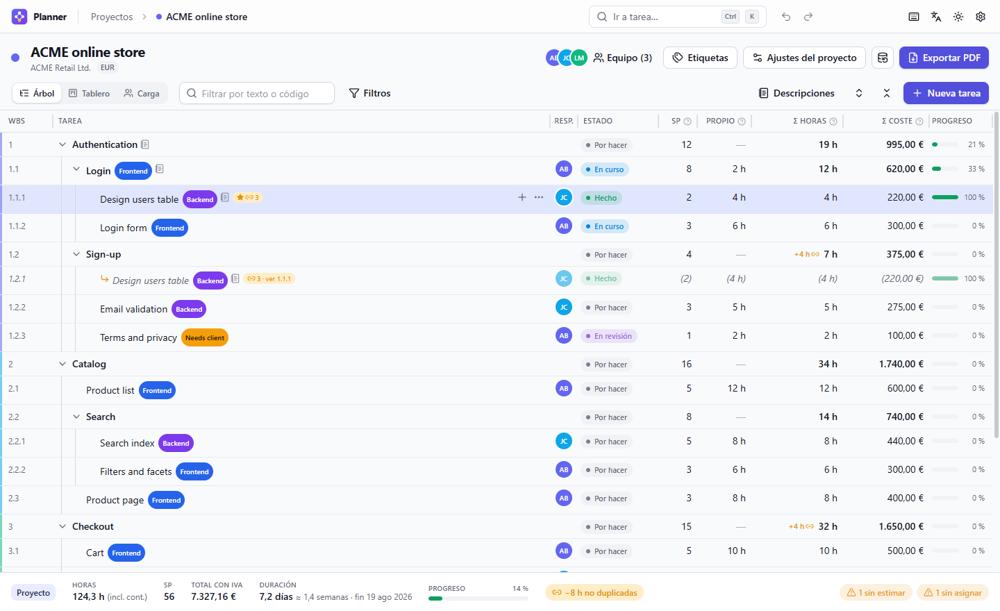

### Theme

The theme button in the top bar (☀ / ☾ / 🖥) opens a menu with three options: Light, Dark or System, which follows the Windows theme. It can also be changed in Settings → General → Appearance.

### Keyboard shortcuts

Press **F1** (or the ⌨ icon) to see them inside the app.

**Create and edit**

| Key | Action |
|---|---|
| Enter | New task below (while typing a title: confirm it and create the next one) |
| Ctrl+Enter | New subtask |
| F2 | Rename (or double-click the title) |
| Esc | Cancel editing (a new task without a title is discarded) |
| Del | Delete, or remove from here if it is a reference |
| Ctrl+D | Duplicate with its subtasks |

**Structure**

| Key | Action |
|---|---|
| Tab / Shift+Tab | Make it a subtask of the previous task / move it up a level |
| Alt+↑ / Alt+↓ | Move up / down |
| Ctrl+Shift+C | Copy the task to share it |
| Ctrl+Shift+V | Paste as shared subtask |

**Navigate**

| Key | Action |
|---|---|
| ↑ / ↓ | Move between tasks (with Shift: select several) |
| ← / → | Collapse / expand |
| Alt+→ / Alt+← | Focus the task (show only its branch) / go back |
| Space | Open or close the detail panel |
| Alt+D | Show or hide descriptions |
| Ctrl+K | Go to any task |
| Ctrl+Z / Ctrl+Y | Undo / redo |
| Ctrl++ / Ctrl+− / Ctrl+0 | Zoom |

---

## Development

### Requirements

- **Node.js 24.**
- **pnpm 11.** Its configuration lives in `pnpm-workspace.yaml`:
  - `allowBuilds` says which dependencies may run install scripts;
  - `minimumReleaseAgeExclude` lists the exceptions to the minimum release age.
- **Windows,** to build the `.exe` files. The app itself can be developed on any system.

### Getting started

```bash
pnpm install
```

```bash
pnpm dev
```

- `pnpm install` installs the dependencies and downloads the Electron binary (`postinstall` script).
- `pnpm dev` opens the app with hot reload of the interface. In development the data is stored in `.planner-data/` (ignored by git). **F12** opens the developer tools.

To try a large project:

```bash
pnpm seed:big
```

### Scripts

| Script | What it does |
|---|---|
| `pnpm dev` | Development with hot reload (electron-vite). |
| `pnpm build` | Builds the main process, the preload and the interface into `out/`. |
| `pnpm preview` | Builds and starts the unpackaged production version. |
| `pnpm typecheck` | Type checks each layer separately ([see tsconfig](#type-checking-per-layer)). |
| `pnpm lint` | ESLint, including the [dependency rules between layers](#dependency-rules). |
| `pnpm test` | Unit and property tests (Vitest + fast-check). |
| `pnpm test:watch` | The same in watch mode. |
| `pnpm test:e2e` | Builds the app and runs the end-to-end tests on the real app (Playwright + Electron). |
| `pnpm dist:win` | Builds the app and creates the installer and the portable exe in `release/`. |
| `pnpm seed:big` | Creates a 5,000-task project in `.planner-data/` to test performance. |
| `pnpm icon` | Regenerates `build/icon.png` and `src/presentation/assets/logo.svg` from `build/icon.svg`. |
| `pnpm docs:screenshots` | Builds the app and regenerates the README screenshots (`docs/images/`) and the sample PDF. |

### Environment variables

| Variable | Effect |
|---|---|
| `PLANNER_DATA_DIR` | Data folder. It takes precedence over everything else. |
| `PLANNER_E2E_DIR` | For tests: save dialogs are not shown and files are written to this folder. |
| `PLANNER_E2E_OPEN` | For tests: files returned by the open dialog, one per call (backup import), separated like `PATH` (`;` on Windows). |
| `ELECTRON_RENDERER_URL` | Set by `pnpm dev`; it points to the Vite server. |

---

## Building the .exe

```bash
pnpm dist:win
```

This command runs two steps:

1. `electron-vite build` builds into `out/`:

   | Output | Contents |
   |---|---|
   | `out/main/index.js` | Main process |
   | `out/preload/index.js` | Preload |
   | `out/renderer/` | Interface |

2. `electron-builder --win --x64` packages it according to `electron-builder.yml` and writes to `release/`:
   - `Planner-<version>-setup.exe` (NSIS installer);
   - `Planner-<version>-portable.exe`;
   - `win-unpacked/`, the unpackaged app, useful for debugging.

Other packaging settings:

- **Version.** The `version` field of `package.json`; it appears in the file names.
- **Icon.** Edit `build/icon.svg` and run `pnpm icon`. This generates `build/icon.png` (512 px), which electron-builder turns into an `.ico`.
- **Fuses.** The executable is hardened with Electron *fuses*: no Node mode (`runAsNode`), no `NODE_OPTIONS` or `--inspect`, encrypted cookies, and loading only from `app.asar` with verified integrity. If someone modifies the `.asar`, the app does not start.
- **Signing.** Disabled (`signExecutable: false`). To sign:
  1. Set `CSC_LINK` (path to the `.pfx` certificate) and `CSC_KEY_PASSWORD`.
  2. Remove that line from `electron-builder.yml`.

  Once the executable is signed, SmartScreen stops warning as soon as the certificate gains reputation.

---

## Architecture

Hexagonal architecture (ports and adapters) on top of Electron's two processes:

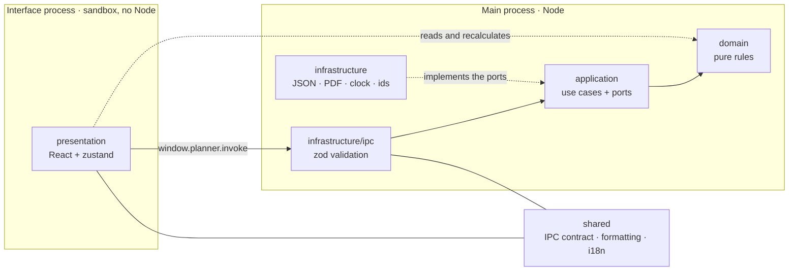
```mermaid
flowchart LR
  subgraph R["Interface process · sandbox, no Node"]
    UI["presentation<br/>React + zustand"]
  end
  subgraph M["Main process · Node"]
    IPC["infrastructure/ipc<br/>zod validation"]
    APP["application<br/>use cases + ports"]
    DOM["domain<br/>pure rules"]
    ADP["infrastructure<br/>JSON · PDF · clock · ids"]
  end
  SH["shared<br/>IPC contract · formatting · i18n"]
  UI -- "window.planner.invoke" --> IPC
  IPC --> APP --> DOM
  ADP -. "implements the ports" .-> APP
  UI -. "reads and recalculates" .-> DOM
  UI --- SH
  IPC --- SH
```

| Layer | Folder | Responsibility |
|---|---|---|
| **Domain** | `src/domain` | Entities, rules, validations, task graph, command reducer and calculations. Plain TypeScript only: no Node, DOM, Electron or libraries. |
| **Application** | `src/application` | Use cases: sessions with undo/redo, catalog, reports and settings. It defines the **ports** (interfaces) for what it needs from the outside. |
| **Infrastructure** | `src/infrastructure` | **Adapters.** Some implement the ports: JSON repository, PDF with Electron, clock and id generator. Others expose the use cases over IPC. The Electron startup and the *composition root* also live here. |
| **Presentation** | `src/presentation` | React interface. It talks to the main process over IPC and reuses the pure domain functions to recalculate totals. |
| **Shared** | `src/shared` | What the main process and the interface share: the typed IPC contract, how to apply a delta, number/date formatting per language, status and priority labels, and the colors of the tags. |

### Dependency rules

`eslint.config.mjs` checks them on every `pnpm lint`. They cover both the aliases (`@application/...`) and relative paths (`../application/...`).

| Layer | May import | May not import |
|---|---|---|
| `domain` | — | Any other layer, nor Node, Electron, React or zod. |
| `application` | `domain` | `infrastructure`, `presentation`, `shared`, Node, Electron, React or zod. The outside world comes in through ports. |
| `shared` | `domain`, and `application` only as `import type` | `infrastructure`, `presentation`, Node, Electron or React. |
| `infrastructure` | `domain`, `application`, `shared`, Node and Electron | `presentation` or React. |
| `infrastructure/electron/preload` | Only `shared` and `electron` | Everything else. |
| `presentation` | `domain`, `shared`, and `application` only as `import type` | `infrastructure`, Node, Electron or zod. |

The tests (`tests/`) are exempt from these rules: they set up scenarios across layers.

Each layer is imported through its alias:

- `@domain` and `@application`, each with its `index.ts` barrel;
- `@infrastructure/*`, `@presentation/*`, `@shared/*` and `@tests/*`.

Relative paths are used within a layer.

### Type checking per layer

`pnpm typecheck` runs four compilations, each with only the types of its environment:

| tsconfig | Includes | Environment |
|---|---|---|
| `tsconfig.core.json` | `domain`, `application`, `shared` | ES2023 without Node or DOM: if someone uses `fs` or `document`, it does not compile. |
| `tsconfig.node.json` | `infrastructure` and the config files | Node |
| `tsconfig.web.json` | `presentation` | DOM + Vite |
| `tsconfig.test.json` | `tests` | Node + DOM |

`tsconfig.json` exists only for the editor.

### Life of a command

This is how, for example, a change of task status travels:

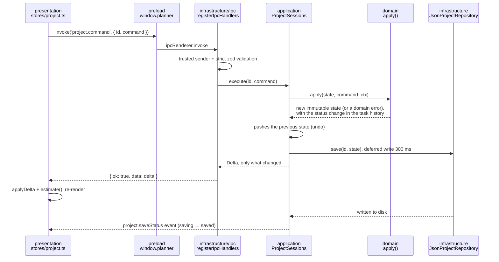
```mermaid
sequenceDiagram
  participant UI as presentation<br/>stores/project.ts
  participant P as preload<br/>window.planner
  participant H as infrastructure/ipc<br/>registerIpcHandlers
  participant S as application<br/>ProjectSessions
  participant D as domain<br/>apply()
  participant R as infrastructure<br/>JsonProjectRepository
  UI->>P: invoke('project.command', { id, command })
  P->>H: ipcRenderer.invoke
  H->>H: trusted sender + strict zod validation
  H->>S: execute(id, command)
  S->>D: apply(state, command, ctx)
  D-->>S: new immutable state (or a domain error),<br/>with the status change in the task history
  S->>S: pushes the previous state (undo)
  S->>R: save(id, state), deferred write 300 ms
  S-->>H: Delta, only what changed
  H-->>UI: { ok: true, data: delta }
  UI->>UI: applyDelta + estimate(), re-render
  R-->>S: written to disk
  S-->>UI: project.saveStatus event (saving → saved)
```

- **A single write path.** The main process is the only one that modifies data. The interface only sends commands.
- **Immutable state.** Each command produces a new state and shares everything that did not change. Undo is just getting the previous state back, and the delta is computed by comparing references.
- **The same numbers in the app and in the PDF.** The interface and the PDF compute the totals with the same pure domain function (`estimate`).

### Folder structure

```
src/
├─ domain/                      Pure business rules
│  ├─ common/                   primitives (ids, Result, errors and their reasons) · money · calendar
│  │                            duration · palette · validation · language (LANGUAGES)
│  ├─ task/                     Task.ts (entity, statuses, priorities, defaults) · validateTask.ts
│  │                            statusHistory.ts (the only writer of the status history)
│  ├─ team/                     Member.ts (person, initials) · validateMember.ts
│  ├─ project/                  Project.ts (ProjectMeta, ProjectState) · validateProject.ts
│  │                            commands.ts (Command union) · apply.ts (pure reducer)
│  │                            createProject.ts · projectData.ts (aggregate ↔ plain data)
│  │                            tags.ts (project tags, palette keys, name rules)
│  │                            contractModel.ts (which contract model of the library a quote uses)
│  ├─ graph/                    TaskGraph.ts (immutable acyclic graph) · wbs.ts (1.2.3 codes, their order)
│  ├─ estimation/               metrics.ts · estimate.ts (totals, contribution, savings, workload, duration)
│  │                            pointScale.ts (story points → hours)
│  ├─ progress/                 sprints.ts (sprint windows, net status changes per sprint)
│  └─ index.ts                  Public API of the domain
├─ application/                 Use cases and ports
│  ├─ ports/                    ProjectRepository · SettingsRepository · ProjectSerializer
│  │                            PdfRenderer · Clock · IdGenerator
│  ├─ projects/                 ProjectSessions (sessions, undo/redo, deltas)
│  │                            ProjectCatalog (create, duplicate, import…) · snapshot.ts (Snapshot, Delta)
│  ├─ reports/                  ReportModel · buildReportModel (additive table) · ReportService
│  ├─ settings/                 Settings (types, defaults, language preference, library of contracts) · SettingsService
│  ├─ errors.ts                 AppError and its reasons
│  └─ index.ts
├─ infrastructure/              Adapters
│  ├─ persistence/json/         codec (format and migrations) · atomicWrite
│  │                            JsonProjectRepository · JsonSettingsRepository
│  ├─ persistence/memory/       InMemoryProjectRepository (for tests)
│  ├─ pdf/                      ElectronPdfRenderer · reportHtml · reportCss · reportText (PDF texts) · descriptionHtml
│  ├─ i18n/                     mainText (native dialog filters, names of copies)
│  ├─ system/                   systemClock · cryptoIdGenerator
│  ├─ validation/               schemas.ts (zod for the files and for the data arriving over IPC)
│  ├─ ipc/                      registerIpcHandlers · inputSchemas · dialogs
│  └─ electron/
│     ├─ main/                  index.ts (startup and window) · container.ts (composition root)
│     │                         paths (data folder) · language (stored language at startup) · security · theme
│     └─ preload/               index.ts (window.planner bridge)
├─ presentation/                React interface
│  ├─ index.html · main.tsx · styles.css (Tailwind) · assets/
│  ├─ app/                      App, TopBar, DialogHost
│  ├─ components/               Reusable components (button, dialog, menu, Rich text, TagChip, SwatchPicker…)
│  ├─ features/                 projects · project · tree · board · workload · detail · summary · dialogs · tags
│  ├─ i18n/                     useI18n · catalogs per area (catalog/*.ts) · error texts
│  ├─ stores/                   zustand state: catalog, project, settings, ui, layout (column and panel widths), toasts
│  └─ lib/                      api (typed IPC client) · keys · storage · cn · useWindowWidth
└─ shared/
   ├─ i18n/language.ts          Locales, language names, resolving "System"
   ├─ ipc/contract.ts           IPC channels with their input and output types
   ├─ ipc/applyDelta.ts         Applies a Delta to a ProjectState
   ├─ ipc/errors.ts             Infrastructure error reasons
   ├─ format.ts                 createFormatter(language): money, hours, dates, date ranges, inputs
   ├─ labels.ts                 Status and priority names per language
   ├─ tagPalette.ts             Fill and text color of each tag color (app and PDF)
   ├─ terms.ts                  Terms as text: paragraphs, clause numbers, appending and splitting clauses, library limits
   └─ time.ts                   localIsoDate · localDateOf (calendar dates in the time zone of the computer)

tests/
├─ support/                     builders (sample scenarios) · arbitraries (fast-check generators)
├─ unit/                        Unit tests, mirroring src/ (+ i18n/ checks for catalogs and code)
└─ e2e/                         Playwright on the built app

scripts/                        make-icon · seed-big · docs-screenshots
build/                          icon.svg / icon.png
docs/                           Screenshots and sample PDF of this README
```

---

## Internationalization

The app is fully bilingual. Each layer only knows what it needs:

| Piece | Where | What it does |
|---|---|---|
| **Language type** | `domain/common/language.ts` | `LANGUAGES = ['en', 'es']` and `Language`. In the domain so every layer can use the type. |
| **Preference** | `application/settings/Settings.ts` | `language: 'system' \| 'en' \| 'es'` in the settings (default `'system'`). |
| **Resolution and locales** | `shared/i18n/language.ts` | `resolveLanguage(preference, systemLocales)`, `LOCALE_OF` (`en-US`, `es-ES`), language names. |
| **Formatting** | `shared/format.ts` | `createFormatter(language)`: money, numbers, hours, days, dates, relative times, and the parsing of typed numbers. Editable values never have thousands separators, so they read back unchanged. |
| **Interface texts** | `presentation/i18n/catalog/*.ts` | One catalog per area (`common`, `tree`, `export`…). Each exports `en` and `es: typeof en`: a missing translation does not compile. |
| **Access from React** | `presentation/i18n/index.ts` | `useI18n()` → `{ language, t, f }`; `getI18n()` for code outside React. |
| **Errors** | `domain`, `application`, `shared/ipc/errors.ts` | Errors carry a `code`, a `reason` and `params`, plus an English `message` as fallback. The interface translates them (`presentation/i18n/errors.ts`). |
| **PDF texts** | `infrastructure/pdf/reportText.ts` | The quote in each language; the export options carry the language. |
| **Main process texts** | `infrastructure/i18n/mainText.ts` | Native dialog filters and the names of copies (“(copy)” / “(copia)”). |
| **Native controls** | `infrastructure/electron/main/index.ts` | Before startup, the stored language sets Chromium's locale (`--lang`), used by the date fields. |

**Adding a text:** add the key to the `en` object of the area's catalog, then the same key to `es` (the compiler will ask for it), and use it as `t.area.key`. Texts with parameters are functions (`count: (n: number) => …`), which also covers plurals. `**bold**` inside a text is rendered with `<Rich text={…} />`.

**Adding a language:**
1. Add its code to `LANGUAGES` and a locale and a name in `shared/i18n/language.ts`.
2. Add its catalogs: the compiler lists every place that is missing (`typeof en` in the interface catalogs, `Record<Language, …>` in `labels.ts`, `reportText.ts` and `mainText.ts`).
3. Optionally map more system locales to it in `resolveLanguage`.

Two tests keep it that way: `tests/unit/i18n/catalogs.test.ts` (same keys in both languages, no Spanish in the English texts, every error reason translated) and `tests/unit/i18n/no-spanish-in-code.test.ts` (comments and literals of the code are in English; Spanish only inside `// i18n:es-start` … `// i18n:es-end` blocks).

---

## Domain model and calculations

### Units

- **Money:** whole cents. Costs are rounded per task.
- **Time:** whole minutes.
- **Percentages:** *basis points* (1% = 100 bps).

That way there are no floating-point errors when adding up.

### Entities

| Entity | Contents |
|---|---|
| **ProjectMeta** | Name, client, color, currency, default rate, hours per day, contingency, tax, start, working days, story points scale, sprint length, **tags of the project** (id, name, color), quote details, and whether it is archived. |
| **Task** | Title, description, status, priority, assignee, story points, estimated minutes, own rate, tag ids and **status history**. |
| **Member** | Name, role, rate, hours per day and color. |
| **TaskGraph** | Structure of the project: an acyclic directed graph with ordered roots and children. `parents(t)[0]` is the **primary parent** of `t`. |

The `ProjectState` aggregate groups the four entities.

- **Tags.** A task refers to tags by id, so renaming or recoloring a tag changes every task at once. Names are unique in the project, ignoring case; a task has at most 20 tags. References to tags (or people) that no longer exist are dropped when a project is loaded.
- **Status history.** `statusHistory` is a list of `{ at, from, to }`, oldest first; `from: null` marks the creation. Only the reducer writes it (`withStatus`): a change is recorded when the status really changes, with a time that never goes back. A duplicated task starts a new history. Undo reverts it with the rest of the state. The latest 1,000 changes are kept.

### Commands

Every change is a `Command`. `apply(state, command, ctx)` is a pure function: it returns the new state or a domain error (`INVALID`, `NOT_FOUND`, `CYCLE`, `DUPLICATE`…), with a `reason` the interface translates.

| Command | Effect |
|---|---|
| `task.create` | Creates a task, top-level or child, at a position. |
| `task.update` / `task.bulkUpdate` | Changes fields of one task, or the status, priority or assignee of several. |
| `task.delete` | `cascade`: the task and the subtasks left without a parent (mark and sweep). `splice`: only the task; its children move up a level. |
| `task.duplicate` | Deep copy of a branch; the interface sends the localized title of the copy. |
| `edge.link` / `edge.unlink` | Adds or removes an appearance: that is how subtasks are shared. Rejected if it would create a cycle. |
| `edge.setPrimary` | Changes the primary parent, i.e. where it is counted. |
| `edge.move` | Moves an appearance: indent, outdent, reorder or drag. |
| `member.add` / `member.addMany` / `member.update` / `member.remove` | Manage the team. Removing someone reassigns their tasks. |
| `project.update` | Project metadata (not its tags). |
| `tag.create` | Creates a tag of the project, optionally giving it to some tasks in the same step. |
| `tag.update` / `tag.delete` | Rename or recolor a tag; delete it, also from its tasks. |
| `tag.assign` | Gives a tag to several tasks, or takes it away. |

### Totals without double counting

Let:

- `own(t)`: minutes, cost and points of task `t`, without its subtasks;
- `children(t)`: its direct subtasks;
- `primary(c)`: the primary parent of `c`.

```
minutes(t)       = hours typed in t  ??  scale(story points of t)  ??  unestimated
scale(p)         = exception(p)  ??  round(p × minutes of 1 point)       (no scale = nothing)
rate(t)          = rate of t  ??  rate of the assignee  ??  default rate of the project
cost(t)          = round(minutes(t) × rate(t) / 60)

total            = Σ own(t)                          for each task, once
contribution(t)  = own(t) + Σ contribution(c)        c ∈ children(t) with primary(c) = t
branch(t)        = Σ own(x)                          x ∈ {t} ∪ descendants(t), each once
```

- **Contribution.** This is the **Σ** column of the tree and the PDF. A shared subtask only adds up under its primary parent; everywhere else it appears as a reference. That is why sibling rows can be added up and the total matches.
- **Branch.** What a task really needs. Its difference from the contribution is the `+X h 🔗` warning.

### Savings from shared subtasks

```
part(h)   = own(h) + Σ part(c)        c ∈ children(h) with a single parent
paths(h)  = number of paths from the roots to h
savings   = Σ part(h) × (paths(h) − 1)       for each h with 2 or more parents
naive     = total + savings                  (what adding up every appearance would give)
```

**Example with the project of the screenshots:**

- “Design users table” (4 h, €220) hangs from Login, Sign-up and Payment gateway, so `paths = 3`.
- `savings = 4 h × (3 − 1) = 8 h`, i.e. €440.
- The total is 113 h, not 121 h.

The whole calculation is linear in tasks + edges. With 5,000 tasks, `estimate` takes about 10 ms.

### Money

```
contingency = round(subtotal × contingency %)
base        = subtotal + contingency
tax         = round(base × tax %)
total       = base + tax
```

### Duration and end date

```
days(p)   = minutes(p) × (1 + contingency %) / 60 / hoursPerDay(p)     for each person p
duration  = max days(p)          (the team works in parallel; whoever takes longest sets the pace)
weeks     = duration / working days per week
end       = start + ⌈duration⌉ working days    (the start day counts if it is a working day)
```

- `minutes(p)` adds up the tasks of person `p`, each once.
- Unassigned hours form their own group and use the project's hours per day.
- It is an **optimistic** estimate: dependencies between tasks are not taken into account.

**Progress** = minutes done / total minutes. Without hours, tasks done / tasks.

### Sprints

```
start       = start date of the project  ??  day it was created (local date)
sprint k    = [start + k × length, start + (k + 1) × length)        k = 0, 1, 2…  (sprint k + 1)
initial(t)  = status of t when the sprint starts   (from of its first change in the sprint, or its creation)
final(t)    = status of t when the sprint ends     (to of its last change in the sprint)
listed      = tasks with initial(t) ≠ final(t)     forward if final comes later in To do < In progress < In review < Done
```

- **Months** keep the day of the start date, clamped to shorter months (31 Jan → 28/29 Feb → 31 Mar), computed from the start each time.
- **Dates.** A change belongs to the sprint of its local date (the time zone of the computer).
- **Edges.** Changes before the start form a “Before sprint 1” group; a change after today (a clock set back) counts in the current sprint.
- Tasks from files older than format 3 have an empty history: their first change already records the status they came from.

---

## Persistence

### Data folder

The folder is chosen in this order of priority:

1. `PLANNER_DATA_DIR`.
2. In the portable version: the `PlannerData` folder next to the `.exe`, if it is writable.
3. In development: `.planner-data/`.
4. Otherwise: `%APPDATA%\Planner\data`.

```
<data folder>/
├─ settings.json                  Theme, language, issuer details, the library of contracts (models and saved texts) and PDF options of each project
├─ projects/<id>.json             One file per project (+ <id>.json.bak, the previous version)
├─ backups/YYYY-MM-DD/<id>.json   Daily copy; kept for 14 days
├─ trash/<id>-<date>.json         Projects moved to the trash, or replaced by an imported backup (never deleted)
└─ quarantine/                    Unreadable files, set aside so they are not lost
```

The column widths of the tree and the width of the detail panel are view preferences of the computer: they live in the browser storage of the app (Chromium profile), not in this folder.

### Project file format

```json
{
  "format": "planner.project",
  "schemaVersion": 4,
  "meta": {
    "id": "…", "name": "ACME online store", "currency": "EUR", "contingencyBps": 1000,
    "pointScale": { "minutesPerPoint": 180, "overrides": [{ "points": 13, "minutes": 2160 }] },
    "sprints": { "length": 2, "unit": "week" },
    "tags": [{ "id": "…", "name": "Frontend", "color": "blue" }],
    "quote": {
      "number": "Q-2026-014", "date": "2026-09-30", "validityDays": 30, "terms": "Payment: 40% on signature…",
      "client": { "legalName": "ACME Retail Ltd.", "taxId": "…", "address": "…", "email": "…", "signerName": "Jordan Smith", "signerId": "", "signerRole": "Head of Digital" },
      "contractModelId": null
    },
    "…": "…"
  },
  "members": [{ "id": "…", "name": "Anna Brooks", "rateCents": 5000, "hoursPerDay": 7, "…": "…" }],
  "tasks": [
    {
      "id": "…", "title": "Login", "status": "in_progress", "estimateMinutes": 120, "assigneeId": "…",
      "tagIds": ["…"],
      "statusHistory": [
        { "at": "2026-08-05T09:00:00.000Z", "from": null, "to": "todo" },
        { "at": "2026-09-08T10:00:00.000Z", "from": "todo", "to": "in_progress" }
      ],
      "…": "…"
    }
  ],
  "structure": {
    "roots": ["…"],
    "children": { "<parent>": ["<child>", "…"] },
    "parents": { "<child>": ["<primary parent>", "<other parent>"] }
  }
}
```

When reading, the file is validated with zod (`infrastructure/validation/schemas.ts`). The domain invariants are also checked: unique ids, a consistent structure and no cycles. The fields added in format 3 are read leniently, so a damaged entry never sends a whole project to quarantine: invalid history entries and tags are dropped, ids of tags that no longer exist are removed from their tasks, and invalid sprint settings fall back to 2 weeks.

### Writing and recovery

- **Deferred writes.** Changes are grouped (300 ms) and written in the background. Pending writes are forced when the app or the Windows session closes.
- **Atomic writes.** The file is written to `<id>.json.tmp`, flushed to disk (`fsync`) and renamed. Before that, the previous version is kept as `.bak`. A power cut never leaves a half-written file.
- **Recovery.** If the main file cannot be read, `.tmp` is tried and then `.bak`. Unreadable files are moved to `quarantine/`.
- **Format versions.**
  - A file from an **older** version is migrated when opened (`MIGRATIONS` in `codec.ts`):
    - version 2 added `meta.pointScale`; version 1 files open without a scale (`null`);
    - version 3 added the status history, the sprints and the project tags. Version 2 files get an empty history and 2-week sprints, and their free-text tags become tags of the project: one per name, ignoring case, with fixed ids (`tag-1`, `tag-2`…) and colors in turn;
    - version 4 added the client as a party of the contract (`meta.quote.client`) and the contract model of the quote (`meta.quote.contractModelId`, an id of the library of the settings; `null` = the default model). Version 3 files get an empty client, whose details are blank lines in the PDF, and the default model.
  - One from a **newer** version opens read-only, so it is not damaged. For example, an app from before version 4 ignores the client of the contract of a version 4 file. Such a project cannot be exported or duplicated either.
- **Settings.** `settings.json` is read field by field: an invalid value falls back to its default without losing the rest. Settings saved before the contract fields existed get them empty, and the library of contracts is read item by item: invalid or repeated models and texts are dropped, and a default model that does not exist is none. Saving some fields of the issuer never clears the others: the IPC patch has no defaults (`IssuerPatchSchema`).

---

## IPC and security

### IPC contract

`src/shared/ipc/contract.ts` defines each channel with its input and output types. If a channel is missing from the `CHANNELS` list, the code does not compile.

Every response is an `IpcResult`: `{ ok: true, data }` or `{ ok: false, error: { code, message, reason?, params? } }`. Errors are never thrown across the bridge.

| Channel | What it does |
|---|---|
| `app.info` · `app.openDataDir` | Version, data folder, portable or not, system languages · open the folder in Explorer |
| `projects.list` · `projects.create` · `projects.duplicate` · `projects.trash` | Project catalog (cards with totals) |
| `projects.exportJson` · `projects.importJson` · `projects.resolveImport` | Export a backup; import one. If the project already exists, `importJson` returns a `clash` with a ticket and `resolveImport` replaces it, keeps both or cancels |
| `projects.members` | Team of another project (to import it) |
| `project.open` · `project.close` | Open a project (returns a full `Snapshot`) and close it |
| `project.command` · `project.undo` · `project.redo` | Run a domain command, undo or redo (they return a `Delta`) |
| `project.exportPdf` | Generate the PDF with the chosen options and language |
| `settings.get` · `settings.set` · `settings.pickLogo` | Preferences (theme, language, issuer) and issuer logo |
| `project.saveStatus` event | Save status: `saving`, `saved` or `error` |

### Security measures

- **Interface window.** It uses `contextIsolation` and `sandbox`, and has no `nodeIntegration`. The preload only exposes `window.planner.invoke(channel, input)` and `on(event)`, and only for the channels of the contract.
- **Validation in the main process.**
  - It checks that the message comes from the app's own interface.
  - It validates with **strict** zod schemas (`infrastructure/ipc/inputSchemas.ts`): an unknown key is an error.
- **Content-Security-Policy.** Strict in production: no inline scripts, no external origins and `object-src 'none'`. It is injected by `electron.vite.config.ts`.
- **Global hardening** (`infrastructure/electron/main/security.ts`):
  - no new windows are opened;
  - no navigation outside the app;
  - no `<webview>`;
  - every permission is denied (camera, notifications…).
- **Other measures:**
  - a single instance of the app;
  - no application menu;
  - the developer tools are only available unpackaged;
  - the window that generates the PDF runs no JavaScript and all user text is escaped;
  - executable fuses (see [Building the .exe](#building-the-exe)).

---

## PDF generation

```
ReportService (application)
  ├─ buildReportModel(state, options, issuer, { now, localDate, contract })  →  ReportModel (raw, already calculated data)
  └─ PdfRenderer (port)
       └─ ElectronPdfRenderer (infrastructure/pdf)
            ├─ renderReportHtml(model)  → HTML + print CSS in the chosen language (reportHtml.ts, reportText.ts, reportCss.ts)
            ├─ hidden window, without JavaScript, that loads that HTML
            └─ printToPDF (A4 or Letter; footer with the quote number, page numbers and, with signatures, initials boxes)
```

- **Sections**, in this order:
  1. cover;
  2. summary with the budget (work, contingency, taxable base, tax and total);
  3. WBS breakdown with subtotals;
  4. task details (if descriptions go in their own section);
  5. task status (with the “Status” option): a bar by number of tasks, lanes with every task by status, and the net changes of each sprint ([rules](#sprints));
  6. team and workload;
  7. shared subtasks appendix (each subtask with the tasks that need it below it);
  8. particular terms of the project, then the general terms of its contract model (with one kind only, a single “Terms” section);
  9. acceptance and signatures: the parties, what they accept, the governing law and courts, and a block for each signature (see [The quote as a contract](#the-quote-as-a-contract)).
- **Page breaks.** Rules of `reportCss.ts`, so no section is cut in an odd place:
  - the summary, the task status and the team start on a new page; the breakdown and the task details follow the previous section;
  - the appendix, each kind of terms and the signatures stay after the previous section only if all of them fit there; otherwise they start on a new page;
  - a page never ends with a title or an introduction alone, a task without its inline description, or a parent without its first subtask;
  - a subtotal or the total never opens a page without the rows it adds up, and table heads repeat on every page;
  - each paragraph of the terms (blank lines separate them) is kept whole;
  - a status lane that continues on another page repeats its head there, and a top-level task never leaves its subtasks.
- **Dates.** “Today” and the sprints use the local date of the computer (`Clock.localDate`), so a change made at 00:30 belongs to that day.
- **Tags.** With the “Tags” option, chips in the colors of `shared/tagPalette.ts` (the same as in the app) follow the task titles in the breakdown, the task details and the status section.
- **Language.** The export options carry the language; texts, number and date formats, the footer and the file name (`… - quote 2026-09-30.pdf` / `… - presupuesto 2026-09-30.pdf`) follow it. The model only carries raw data (an untitled task has an empty title); the renderer adds the localized placeholders.
- **Additive table.** A shared subtask has amounts only under its primary parent. Everywhere else a `↗ … shared · see 1.1.1` row appears without figures. The total says “each shared subtask counted once”, and the appendix explains how much double counting was avoided.
- **Breakdown levels.** If the depth is limited, deeper levels are added into their visible task.
- **Descriptions.** They are turned into safe HTML by `descriptionHtml.ts`: paragraphs, lists and bold, with all text escaped.

---

## Tests

```bash
pnpm test
```

```bash
pnpm test:e2e
```

- `pnpm test` runs the unit, property and i18n tests.
- `pnpm test:e2e` builds the app and runs the end-to-end scenarios.

| Type | Where | What it covers |
|---|---|---|
| **Domain** | `tests/unit/domain` | Graph (cycles, moves, primary parent, WBS codes), command reducer, durations, estimation, story points scale, status history, sprints (windows, net changes per sprint), project tags, the client of the contract and error reasons. |
| **Properties** | fast-check in the domain, application and shared tests | Invariants after random command sequences: no cycles, `naive − total = savings`, the status history ends in the current status and never goes back in time, tags always exist, undo and redo return to the same state, deltas rebuild exactly the state of the main process, and typed numbers read back unchanged in both languages. |
| **Performance** | `tests/unit/domain/estimation/perf.test.ts` | `estimate` with 5,000 tasks. |
| **Application** | `tests/unit/application` | Sessions and deltas, catalog (duplicate, export and import of backups: keep both, replace, cancel; projects from newer versions refused) and report model (the table adds up to the total, the status section and its sprints, tags). |
| **Shared** | `tests/unit/shared` | Formatting and parsing in English and Spanish, resolving the “System” language, contrast of the tag colors. |
| **Infrastructure** | `tests/unit/infrastructure` | JSON repository (atomic writes, recovery, quarantine, backups, migrations 1 → 2 → 3 → 4, damaged new fields cleaned up), PDF HTML in both languages (escaping, descriptions, placeholders, file name, status section, tags, particular and general terms, signatures page, initials in the footer, page breaks), zod schemas (old settings and options, issuer patches that keep the other fields) and the stored language read at startup. |
| **Presentation** | `tests/unit/presentation` | Flattening the tree into rows, the queue of keys typed while a task is being created, column and panel widths, and the drafts of the story points and sprints tabs. |
| **i18n** | `tests/unit/i18n` | Catalogs complete in both languages and code written in English. |
| **E2E** | `tests/e2e` | The real app with Playwright: planning with the keyboard, sharing a subtask without double counting, undo, PDF export, persistence after restarting, team, descriptions, hours from story points, switching the language, project tags (create once, reuse, rename, filter, bulk), resizing columns and the panel, long titles that wrap, status history and sprints with the PDF, exporting and importing backups, and the quote as a contract (a library of contracts per country and saved texts, reused in a project, and the signatures page). |

The E2E tests start the built app with a temporary data folder (`PLANNER_DATA_DIR`), automatic dialogs (`PLANNER_E2E_DIR`), a temporary Chromium profile and a fixed language, so they do not depend on the machine.

---

## Adding a feature

**Example:** a **due date** (`dueDate`) on tasks. Each step touches a single layer:

1. **Domain** (`src/domain`):
   - In `task/Task.ts`, add the field to `Task`, `TaskFields` and `DEFAULT_TASK_FIELDS`.
   - In `task/validateTask.ts`, validate it (for example with `isIsoDate`), with an error `reason`.
   - Add tests in `tests/unit/domain/`.
2. **Persistence** (`src/infrastructure`):
   - Add the field to the schema in `validation/schemas.ts`. Read new fields leniently (`.catch(…)`), so a damaged value is cleaned up instead of sending the project to quarantine.
   - If older files do not have it, bump `CURRENT_SCHEMA_VERSION` in `persistence/json/codec.ts`.
   - Add the migration to `MIGRATIONS` (literal values, and it must never throw) and a test that opens a file of the previous version.
   - If the field refers to ids, `fromProjectData` (`domain/project/projectData.ts`) must drop references that no longer exist, and `copyWithNewIds` must remap them if they are task or person ids.
3. **IPC.** Add the field to the `TaskPatch` schema in `infrastructure/ipc/inputSchemas.ts`. The objects are strict: without the field, the main process rejects the message.
4. **Application** (`src/application`). Nothing to do for a new field: `task.update` already carries it.
   - For a **new use case**, create the service here. If it needs something external, define a port in `application/ports/` and its adapter in `infrastructure/`.
   - Wire them in `infrastructure/electron/main/container.ts`.
5. **Presentation** (`src/presentation`):
   - Add the control in `features/detail/TaskDetailPanel.tsx`, with its texts in `i18n/catalog/detail.ts` (`en` and `es`).
   - To see it in the tree, add a cell in `features/tree/TreeRowView.tsx` and its header in `TreeView.tsx`, and add the column to `TREE_COLUMNS` and `COLUMN_LIMITS` in `stores/layout.ts` (its width then becomes resizable). Rows are memoized: pass them values that keep their reference while they do not change.
6. **PDF.** Add the data in `application/reports/buildReportModel.ts`, render it in `infrastructure/pdf/reportHtml.ts` and add its labels to `reportText.ts`.
7. **Check:**

   ```bash
   pnpm typecheck && pnpm lint && pnpm test && pnpm test:e2e
   ```

**Other cases:**

| If you need… | Steps |
|---|---|
| A **new command** | Add it to the `Command` union (`domain/project/commands.ts`) and handle it in `domain/project/apply.ts`. Add its zod schema in `inputSchemas.ts`. In the interface, send it with `dispatch` from `presentation/stores/project.ts`. |
| A **new IPC channel** | Add it to `Contract` and `CHANNELS` in `shared/ipc/contract.ts`. Add its handler in `infrastructure/ipc/registerIpcHandlers.ts`. |
| Another **storage** (for example SQLite) | Implement `ProjectRepository` in `infrastructure/persistence/sqlite/` and swap it in `container.ts`. The domain, application and interface do not change. |

---

## Troubleshooting

| Problem | Solution |
|---|---|
| **SmartScreen blocks the `.exe`** | Click “More info” and then “Run anyway”, or [sign the executable](#building-the-exe). |
| **The portable version saves to `%APPDATA%`** | The folder of the `.exe` is not writable (for example, inside `Program Files`). Move it to a folder of your own. |
| **A project does not appear or does not open** | Look in `quarantine/` (damaged files), `backups/` (daily copies) and `trash/` (trash, and versions replaced by an imported backup) inside the data folder. To recover a copy, close the app and copy the file to `projects/`, or use “Import backup…”. |
| **The PDF shows no sprints, or all changes in the current sprint** | Sprints count from the project start date (Planning and costs). Changes are only recorded from format 3 on: projects from earlier versions have no past history. |
| **“The file comes from a newer version of Planner”** | It was created with a later version of the app. It opens read-only: update the app. |
| **Date fields keep the format of the previous language** | Native date fields follow the language the app started with: restart the app. |
| **`pnpm install` rejects a version because of `minimumReleaseAge`** | pnpm 11 does not install versions published very recently. Wait, or add the version to `minimumReleaseAgeExclude` in `pnpm-workspace.yaml`. |
| **“Electron failed to install correctly”** | Run `pnpm exec install-electron` to download the binary. |
| **The E2E tests use old code** | `playwright test` uses what is in `out/`. `pnpm test:e2e` builds first; if you run Playwright by hand, run `pnpm build` before. |
| **The packaged app does not start after touching `resources/app.asar`** | Expected: the fuses verify the integrity of the `.asar`. Build it again with `pnpm dist:win`. |
| **ESLint: “import is restricted from being used by a pattern”** | A [layer rule](#dependency-rules) was crossed. Move the code to the layer it belongs to, or use `import type` if you only need the type. |
| **A test fails with “The code is written in English”** | A comment or literal outside a `// i18n:es-start` … `// i18n:es-end` block contains Spanish. Translate it, or move the text to the `es` catalog. |

---

## License

Planner is **source-available** under the [PolyForm Noncommercial License 1.0.0](LICENSE.md):

- You may use, copy, modify and share it for any **noncommercial** purpose: personal use, study, research, hobby projects, and use by charities, schools, public research organizations or government institutions.
- **Any commercial use needs a separate license**, including using it at work, for example to prepare quotes for paying clients. To ask for one, [open an issue](../../issues/new) in this repository.

Because it restricts commercial use, it is not an open source license in the OSI sense. The third-party libraries the app uses keep their own (permissive) licenses.

Required Notice: Copyright 2026 Daniel Cano Carrascosa
